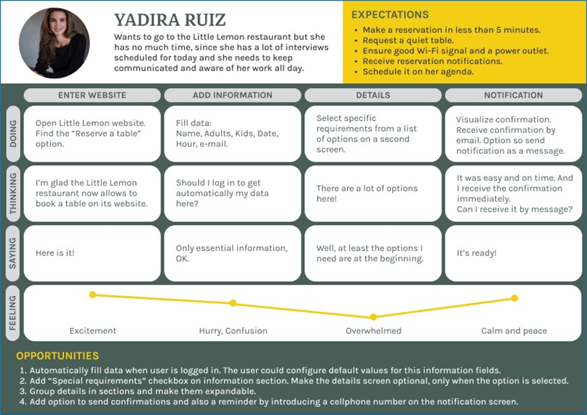

# Little Lemon Capstone

Capstone for the Meta Front-End Developer Professional Certificate.

A responsive website was designed for the Little Lemon restaurant with the option to make an online reservation.

The reservation page allows users to enter their details and select between the different available dates and times, as well as giving the option to enter special requests for your visit.

### UI and UX design

This project was the final stage of a Front End learning journey, that included also a design process with different stages.

Although this process focused more on the design of the page on mobile devices, it is possible to see the evolution from them, which is why they are presented below:

1. A [persona](https://www.figma.com/proto/aEClVKe4ZWJ4CDWY6mqgW3/Little-Lemon-Project?node-id=302-112&t=oXCkMu6K43Mxi1ON-1&scaling=contain&page-id=302%3A110 ) creation. 

2. A [journey map](https://www.figma.com/proto/aEClVKe4ZWJ4CDWY6mqgW3/Little-Lemon-Project?node-id=308-82&t=zyESF54rLVe6pWpQ-1&scaling=min-zoom&page-id=306%3A82 ) analysis. 

3. The [wireframes](https://www.figma.com/proto/aEClVKe4ZWJ4CDWY6mqgW3/Little-Lemon-Project?node-id=323-584&t=RiFUZQlkAOMcFRVl-1&scaling=scale-down&page-id=313%3A428 ) design. 

4. A [prototype](https://www.figma.com/proto/aEClVKe4ZWJ4CDWY6mqgW3/Little-Lemon-Project?node-id=322-171&t=745urEme6OuF2qpD-1&scaling=scale-down&page-id=322%3A170&starting-point-node-id=322%3A171 ) implementation. 

Those were designed in Figma and you can access their preview by clicking the corresponding links of each one.